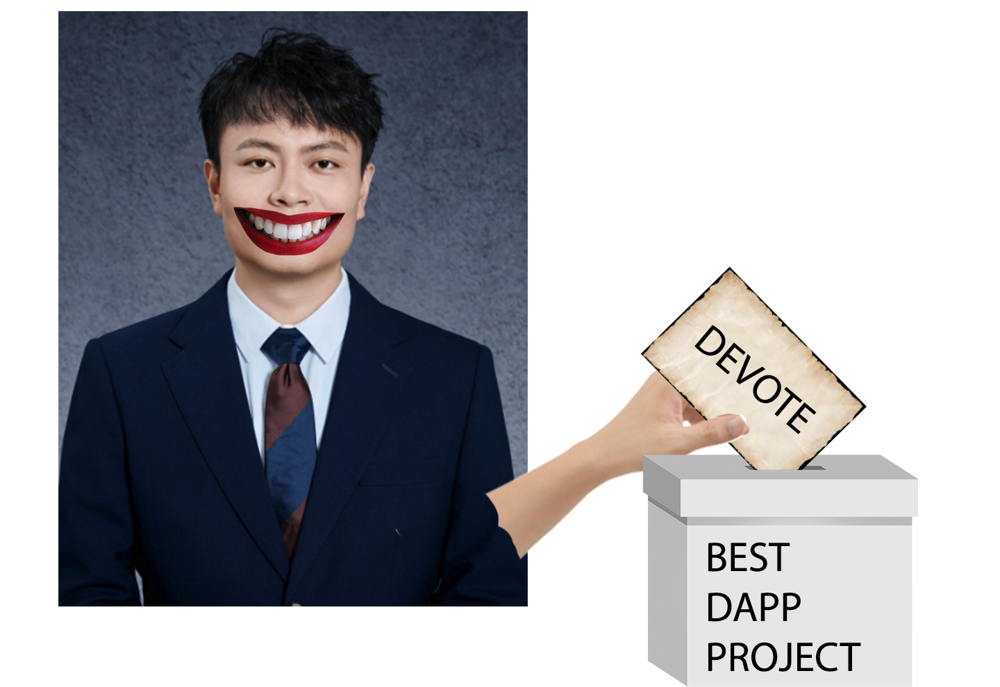

# DEVote
Decentralized voting app

To initialize the frontend, go to the `frontend` , install `vite` globally using `npm i vite` and `npm run dev` command  
To initialize the blockchain use the Remix IDE for Desktop and Metamask

Dashboard

Create an election

Dashboard with modifications

Cast votes

View election results

 
